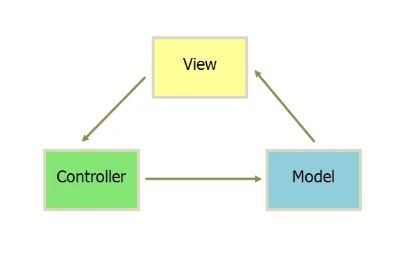

# vue-learn

学习什么东西首先要知道为什么去学习？学习它主要可以做什么？

## 什么是 vue

是一个渐进式的框架！MVVM 模式的！
Vue (读音 /vjuː/，类似于 view) 是一套用于构建用户界面的渐进式框架。与其它大型框架不同的是，Vue 被设计为可以自底向上逐层应用，即渐进式的应用。Vue 的核心库只关注视图层，不仅易于上手，还便于与第三方库或既有项目整合。另一方面，当与现代化的工具链以及各种支持类库结合使用时，Vue 也完全能够为复杂的单页应用提供驱动。

## 框架和库的区别

使用框架： 框架会在合适的时候调用我们写的代码
使用库： 我们在任何时候，都可以调用库中的代码
you call library, frameworks call you!

## 什么是 MVVM MVC MVP

都是设计典范！对于代码按照功能进行分层。

MVC:

- Model: 模型 数据保存（负责提供数据的代码）
- View: 视图 用户界面 （负责显示数据的代码）
- Controller: 控制器 业务逻辑 （负责将 view 中的数据存储到 model 的代码）

MVC 各个部分之间通信的方式如下：

1.视图传送指令到控制器 2.控制器完成业务逻辑后要求模型改变状态 3.模型将新的数据发送到视图，用户得到反馈 通信是单向的

MVP:
MVP 模式将 Controller 改名为 Presenter，同时改变了通信方向 各部分之间的通信都是双向的 1.各部分之间的通信都是双向的。 2.视图（View）和模型（Model）不发生联系，都是通过表现（Presenter）传递
3.View 非常薄，不部署任何业务逻辑，称为被动视图（Passive View），即没有任何主动性，而 Presenter 非常厚，所有逻辑都这里。

MVP 适用于事件驱动的应用架构中，如 asp.net web form，windows forms 应用。程序员需要在 Presenter 里面写代码

MVVM:
MVVM 模式将 Presenter 层替换为 ViewModel，其他与 MVP 模式基本一致 只是这个代码是由框架提供的
它和 MVP 的区别是，采用双向绑定，视图层（View）的变动，自动反映在 ViewModel，反之亦然。Angular 和 Vue，React 采用这种方式。

MVVM 的提出源于 WPF，主要是用于分离应用界面层和业务逻辑层，WPF，Siverlight 都基于数据驱动开发。

MVC 与 MVVM 的区别:

- Controller vs ViewModel：MVC 的 Controller 直接操作 View 和 Model，而 MVVM 的 ViewModel 主要通过数据绑定将 Model 的数据转化成 View 所需要的格式，且不直接操作 View。
- 视图更新：在 MVC 中，Controller 负责通知视图进行更新，而在 MVVM 中，视图的更新通常通过数据绑定自动完成。
  解耦：MVVM 模式通过数据绑定和 ViewModel 实现了更高程度的解耦，View 和 Model 之间不直接通信，而 MVC 中 View 与 Controller 紧密交互。

MVW: Model View Whatever
MV\*: 泛指所有的设计典范！

## 使用 Vue 的基本步骤

```html
<div id="app">{{msg}}</div>
<script src="./vue.js"></script>
<script>
  const vm = new Vue({
    // 给vm实例指定要管理的视图范围
    el: '#app',
    data: {
      // 这里放得就是给视图提供的数据
      msg: 'Hello Vue',
    },
  })
</script>
```

## 插值表达式

Mustache 小胡子语法 标签将会被替代为对应数据对象上 msg 属性的值 无论何时，绑定的数据对象上 msg 属性发生了改变，插值处的内容都会更新。

```html
文本
<div>{{msg}}</div>
<div>{{1 + 1}}</div>
<div>{{msg.toUpperCase()}}</div>
<div v-once>{{This will never change: {{msg}}}}</div>
只渲染元素和组件一次。随后的重新渲染，元素/组件及其所有的子节点将被视为静态内容并跳过。这可以用于优化更新性能。
原始HTML 双大括号会将数据解释为普通文本，而非 HTML 代码。为了输出真正的
HTML，你需要使用 v-html 指令
<div v-html="htmlvalue"></div>

Mustache 语法不能作用在 HTML 特性上，遇到这种情况应该使用 v-bind 指令
属性绑定指令 语法： `
<div v-bind:属性名="表达式"></div>
` 简写语法： `
<div :属性名="表达式"></div>
`
<div v-bind:id=""></div>

对于布尔特性 (它们只要存在就意味着值为 true)，v-bind 工作起来略有不同 如果
isButtonDisabled 的值是 null、undefined 或 false，则 disabled
特性不会渲染在按钮属性上 使用 JavaScript 表达式
<div v-bind:id="'list-' + id"></div>
{{ ok ? 'YES' : 'NO' }} 这些表达式会在所属 Vue 实例的数据作用域下作为 JavaScript
被解析。有个限制就是，每个绑定都只能包含单个表达式 一般可使用三元表达式
```

## 双向绑定指令

双向绑定： 数据发生变化，页面元素页发生变化，页面元素发生变化，数据也同样发生变化
单项绑定： 数据发生变化，页面元素页发生变化 语法： v-model="数据"

## vue 内的 v-model 数据双向绑定原理

```js
var ipt = document.querySelector('#ipt')
var obj = {
  msg: '这是原始数据，元素',
}
ipt.value = obj.msg
//1. 元素变 数据变
ipt.addEventListener('input', function () {
  obj.msg = this.value
})
//2. 数据变 元素变
// obj:要在其上定义属性的对象
// prop: 要定义或者修改的属性名字
// descriptor: 将被定义或修改的属性描述符
// Object.defineProperty(obj, prop, descriptor)
// 语法： Object.defineProperty(要给谁添加属性, 要添加的属性名, 要添加的属性的描述信息)
// var oldVal // 全局变量 会存在污染 数据劫持
Object.defineProperty(obj, 'msg', {
  // 这个方法 会在对象的属性被赋值的时候被自动调用
  // 这个被赋予的值会作为参数传递过来
  set: function (value) {
    // ipt.value = oldVal = value
    console.log('属性被赋值的时候调用')
    // 把这个值存在_msg里面
    this._msg = value
    ipt.value = this._msg
  },
  // 这个方法会在对象的属性被取值的时候被自动调用
  // 这个方法的返回值 就是最终获取到的属性的值
  // 没有参数 但是会传入 this 对象 （由于继承关系，这里的this并不一定是定义该属性的对象）
  get: function () {
    // return oldVal
    console.log('属性被取值的时候调用', this)
    return this._msg
  },
})
// 更多：https://www.cnblogs.com/tylerdonet/p/9893065.html
```

## 指令

```html
指令是带有 v- 前缀的特殊特性
其值是预期单个js的表达式（v-for是一个例外情况）它的职责：当js表达式的值发生改变
将这个产生的连带影响 响应式地作用于DOM
[一些指令能够接收一个参数，在指令名称后面以冒号表示]

<a V-bind:href="url">链接</a> href 是参数 <a v-on:click="doSome"></a> click
是参数 1. 事件处理函数中的this是什么？
this指的就是当前的vue实例，我们可以通过this快速访问到数据！ this.msg 2.
事件对象如何获取 2.1. v-on:事件名称.修饰符="函数名" 直接通过形参e接收即可 2.2.
v-on:事件名称.修饰符="函数名()"
需要在注册事件的时候手动的传入$event，用形参e来接收 动态参数
可以用方括号[]括起来的JavaScript表达式作为一个指令或者事件名来作为参数
<input @[type?change:focus]="event" />

修饰符 以半角.号指明的特殊后缀 用于指出一个指令应该以特殊的方式绑定
.stop就代表event.stopPropagation()，阻止事件冒泡
.prevent就代表event.preventDefault()，阻止默认行为 （该修饰符告诉v-on指令
对于触发的事件(在触发后)调用 event.preventDefault()） 缩写 v-bind: === : v-on:
=== @
```

## vue 实例为什么可以访问到数据

vm.数据名 this.数据名

在创建 vue 实例的时候 会将参数对象 data 内所有的属性 通过 Object.defineProperty 方法添加到 vue 实例中 最终视图中绑定的数据使用的也是 vue 实例中的数据
